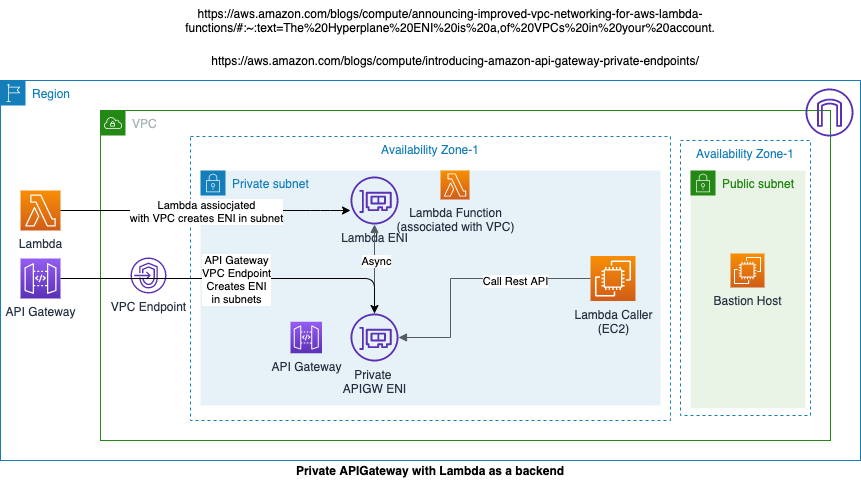

### Private API invoked from EC2

This covers how to deploy private APIGateway REST API using AWS PrivateLink and use Lambda function as a backend, which is assocaited with a VPC. Private APIs are accessible only from within your VPCs.



#### Steps to deploy

- change directory to this example
- update vars.env with values specific to your environment
    - PROJECT_NAME=demoproject

    - KEY_PAIR=EC2 Keypair name in your AWS Account Id, this is required to login to Bastion host and to API Gateway caller EC2 host
    
    - AWS_PROFILE=Name of your AWS profile that points to your AWS Account. You can set AWS profile using ***aws configure --profile profile_name** e.g. aws configure --profile practice_account, use practice_account as a value for AWS_PROFILE 
    
    - LAMBDA_FUNCTION_BUCKET=S3 bcuket where you want to upload your Lambda function

- once you update vars.env, set the environment variables using following on your local terminal

    ```$ source vars.env```

- deploy stack

    ```$ ./deploy.sh```

- once the stack is deployed, ssh into bastion host using the Keypair that you mentioned in the environment variables.

- from bastion host, ssh into EC2 which is in the private subnet

- run the following to install python3, boto3 and requests package
    
    - installation requires EC2 to have access to the internet hence using NAT Gateways.
    
    ```sudo yum install python3 -y```
    ```sudo pip3 install boto3```
    ```sudo pip3 install requests```

    - post installation, remove public route that is using NAT Gateway from 2 Private Route Tables. Go to VPC console, click on Route tables, select private route tables and remove the routes.

- on the private subnet EC2, copy **api-client.py** from this folder

#### Test Private API using CURL

- To invoke Private API using the VPC Endpoint DNS name, use the following

    - curl -X POST https://{VPC DNS Endpoint}/{stage}/{resource} -H 'Host: {API Stage url}'

        - note:- when replace values, replace curly braces also

        - For Example

        curl -X POST https://vpce-031b27778cea43c52-s0xe73bc.execute-api.ap-southeast-2.vpce.amazonaws.com/demo/democall -H 'Host: 947qz23u3d.execute-api.ap-southeast-2.amazonaws.com'

    - Or you can this
    
        curl -X POST https://{public-dns-hostname}.execute-api.{region}.vpce.amazonaws.com/test -H'x-apigw-api-id:{api-id}'

        - For Example

        curl -X POST https://vpce-031b27778cea43c52-s0xe73bc.execute-api.ap-southeast-2.vpce.amazonaws.com/demo/democall -H 'x-apigw-api-id:947qz23u3d'

- You can also invoke the Private API using API Stage DNS endpoint

    - For example

        curl -X POST  https://947qz23u3d.execute-api.ap-southeast-2.amazonaws.com/demo/democall


- It's an synchronous implementation to call Lambda function.

#### Test Private API using api-client

- from the EC2 terminal in private subnet, run the following command to test the api invoking Lambda synchronously

```$ python3 api-client.py```

this will invoke Lambda function in an synchronous way

#### Clean up

```$ ./deploy.sh delete```

#### Scratch Pad notes:

- Install Python 3 and Boto3 on Lambda caller host
        ```sudo yum install python3 -y```
        ```sudo pip3 install boto3```
        ```sudo pip3 install requests```


