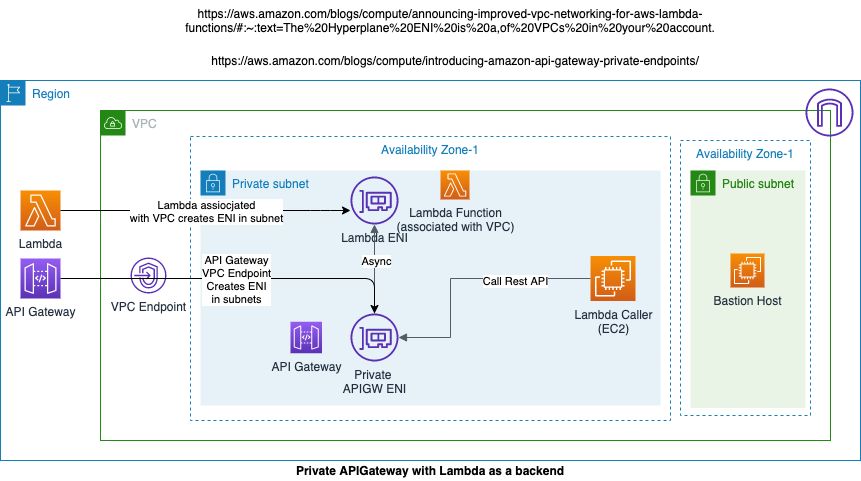

### Private API invoked from EC2

This covers how to deploy private APIGateway REST API using AWS PrivateLink and use Lambda function as a backend, which is assocaited with a VPC. Private APIs are accessible only from within your VPCs.



#### Steps to deploy

- change directory to this example
- update vars.env with values specific to your environment
    - PROJECT_NAME=demoproject

    - KEY_PAIR=EC2 Keypair name in your AWS Account Id, this is required to login to Bastion host and to API Gateway caller EC2 host
    
    - AWS_PROFILE=Name of your AWS profile that points to your AWS Account. You can set AWS profile using ***aws configure --profile profile_name** e.g. aws configure --profile practice_account, use practice_account as a value for AWS_PROFILE 
    
    - LAMBDA_FUNCTION_BUCKET=S3 bcuket where you want to upload your Lambda function

- once you update vars.env, set the environment variables using following on your local terminal

    ```$ source vars.env```

- deploy stack

    ```$ ./deploy.sh```

- once the stack is deployed, ssh into bastion host using the Keypair that you mentioned in the environment variables.

- from bastion host, ssh into EC2 which is in the private subnet

- run the following to install python3, boto3 and requests package
    
    - installation requires EC2 to have access to the internet hence using NAT Gateways.
    
    ```sudo yum install python3 -y```
    ```sudo pip3 install boto3```
    ```sudo pip3 install requests```

    - post installation, remove public route that is using NAT Gateway from 2 Private Route Tables. Go to VPC console, click on Route tables, select private route tables and remove the routes.

- on the private subnet EC2, copy **api-client.py** from this folder

#### Test Private API using CURL

- To invoke Private API using the VPC Endpoint DNS name, use the following

    - curl -X POST https://{VPC DNS Endpoint}/{stage}/{resource} -H 'Host: {API Stage url}'

        - note:- when replace values, replace curly braces also

        - For Example

        curl -X POST https://vpce-031b27778cea43c52-s0xe73bc.execute-api.ap-southeast-2.vpce.amazonaws.com/demo/democall -H 'Host: 947qz23u3d.execute-api.ap-southeast-2.amazonaws.com'

    - Or you can this
    
        curl -X POST https://{public-dns-hostname}.execute-api.{region}.vpce.amazonaws.com/test -H'x-apigw-api-id:{api-id}'

        - For Example

        curl -X POST https://vpce-031b27778cea43c52-s0xe73bc.execute-api.ap-southeast-2.vpce.amazonaws.com/demo/democall -H 'x-apigw-api-id:947qz23u3d'

- You can also invoke the Private API using API Stage DNS endpoint

    - For example

        curl -X POST  https://947qz23u3d.execute-api.ap-southeast-2.amazonaws.com/demo/democall


- It's an Asynchronous implementation to call Lambda function. You can go to CloudWatch logs and see Lambda is still printing the numbers while you have already recieved the response back from the API.

#### Test Private API using api-client

- from the EC2 terminal in private subnet, run the following command to test the api invoking Lambda asynchronously

```$ python3 api-client.py```

this will invoke Lambda function in an asynchronous way, you can go and check the cloud watch logs, lambda should still be working...

#### Clean up

```$ ./deploy.sh delete```

#### Scratch Pad notes:

- Install Python 3 and Boto3 on Lambda caller host
        ```sudo yum install python3 -y```
        ```sudo pip3 install boto3```
        ```sudo pip3 install requests```


