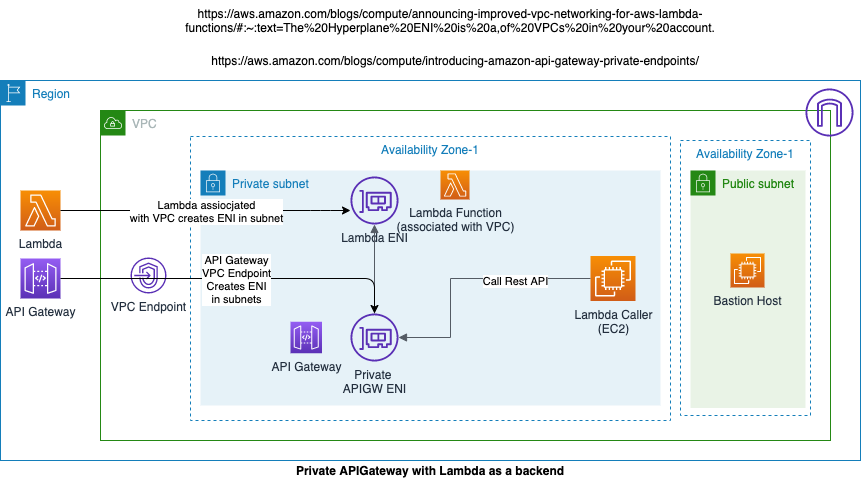

### Private API invoked from EC2

This covers how to deploy private APIGateway REST API using AWS PrivateLink and use Lambda function as a backend, which is assocaited with a VPC. Private APIs are accessible only from within your VPCs.



#### Steps to deploy

- change directory to this example
- update vars.env with values specific to your environment
    - PROJECT_NAME=demoproject
    - AWS_ACCOUNT_ID={this is your AWS Account ID where you will run this}
    - KEY_PAIR=EC2 Keypair name in your AWS Account Id, this is required to login to Bastion host and to API Gateway caller EC2 host
    - AWS_PROFILE=Name of your AWS profile that points to your AWS Account. You can set AWS profile using ***aws configure --profile profile_name** e.g. aws configure --profile practice_account, use practice_account as a value for AWS_PROFILE 
    - LAMBDA_FUNCTION_BUCKET=S3 bcuket where you want to upload your Lambda function

- once you update vars.env, set the environment variables using following on your local terminal

    ```$ source vars.env```

- deploy stack

    ```$ ./deploy.sh```

- clean up

    ```$ ./deploy.sh delete```


#### Test Private API

- To invoke Private API using the VPC Endpoint DNS name, use the following

    - curl -v http://{VPC DNS Endpoint}/{stage}/{resource} -H 'Host: {API Stage url}'

        - note:- when replace values, replace curly braces also

        - For Example

        curl -v https://vpce-031b27778cea43c52-s0xe73bc.execute-api.ap-southeast-2.vpce.amazonaws.com/demo/democall -H 'Host: 947qz23u3d.execute-api.ap-southeast-2.amazonaws.com'

    - Or you can this
    
        curl -v https://{public-dns-hostname}.execute-api.{region}.vpce.amazonaws.com/test -H'x-apigw-api-id:{api-id}'

        - For Example

        curl -v https://vpce-031b27778cea43c52-s0xe73bc.execute-api.ap-southeast-2.vpce.amazonaws.com/demo/democall -H 'x-apigw-api-id:947qz23u3d'

- You can also invoke the Private API using API Stage DNS endpoint

    - For example

        curl -v  https://947qz23u3d.execute-api.ap-southeast-2.amazonaws.com/demo/democall


